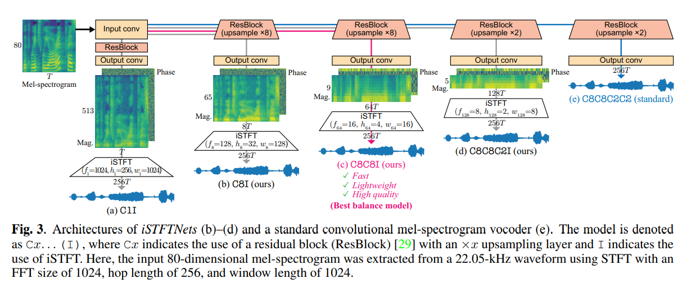

# iSTFTNet : Fast and Lightweight Mel-spectrogram Vocoder Incorporating Inverse Short-time Fourier Transform
This repo try to implement [iSTFTNet : Fast and Lightweight Mel-spectrogram Vocoder Incorporating Inverse Short-time Fourier Transform](https://arxiv.org/pdf/2203.02395.pdf) specifically model `C8C8I`.

`Disclaimer : This repo is build for testing purpose. The code is not optimized for performance.`
## Training :
```
python train.py --config config_v1.json
```

## Citations :
```
@inproceedings{kaneko2022istftnet,
title={{iSTFTNet}: Fast and Lightweight Mel-Spectrogram Vocoder Incorporating Inverse Short-Time Fourier Transform},
author={Takuhiro Kaneko and Kou Tanaka and Hirokazu Kameoka and Shogo Seki},
booktitle={ICASSP},
year={2022},
}
```
